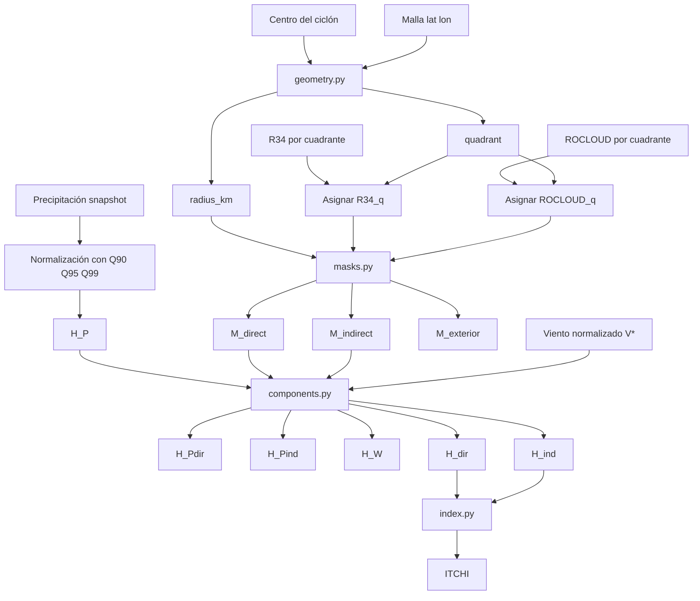

# Arquitectura del repositorio ITCHI Core

## 1. Propósito del repositorio

`itchi-core` contiene el núcleo computacional para calcular **ITCHI v0.1** (*Integrated Tropical Cyclone Hazard Index*).

El objetivo del repositorio es implementar de forma modular, trazable y reproducible el cálculo del índice físico de peligro asociado a ciclones tropicales.

El repositorio no busca resolver todavía:

- evaluación con declaratorias;
- agregación municipal definitiva;
- calibración estadística;
- productos finales para publicación;
- dashboard o visualización operativa.

Estas partes se consideran fases posteriores.

---

## 2. Principio general de ITCHI

ITCHI v0.1 calcula un índice continuo en el intervalo:

```text
0 ≤ ITCHI ≤ 1
````

El índice integra tres fuentes físicas de peligro:

1. precipitación directa dentro de `R34`;
2. viento dentro de `R34`;
3. precipitación indirecta entre `R34` y `ROCLOUD`.

La región exterior a `ROCLOUD` no contribuye al índice.

---

## 3. Convenciones principales

### 3.1. Resolución espacial

La resolución espacial objetivo es:

```text
0.1° × 0.1°
```

Esta resolución es compatible con la malla de precipitación usada como referencia.

### 3.2. Resolución temporal

El índice se evalúa en tiempos sinópticos:

```text
00, 06, 12 y 18 UTC
```

### 3.3. Precipitación

En la arquitectura actual del repositorio, la precipitación se maneja como:

```text
snapshot
```

Esto significa que el campo de precipitación se toma como un estado o intensidad válida en un tiempo determinado.

Por tanto, el núcleo del repositorio no debe asumir que la precipitación es acumulada.

### 3.4. Radios

Los radios se manejan por cuadrante usando la convención interna:

```text
RNE = radio noreste
RSE = radio sureste
RSW = radio suroeste
RNW = radio noroeste
```

### 3.5. Unidades

Todas las comparaciones geométricas se realizan en kilómetros.

Por tanto:

```text
radius_km
R34_q
ROCLOUD_q
```

deben estar en kilómetros antes de construir máscaras.

Si `R34` proviene de IBTrACS en millas náuticas, debe convertirse mediante:

```text
1 nautical mile = 1.852 km
```

---

## 4. Estructura actual del paquete

La estructura principal del paquete es:

```text
src/
└── itchi/
    ├── __init__.py
    ├── constants.py
    ├── config.py
    ├── units.py
    ├── geometry.py
    ├── precipitation.py
    ├── masks.py
    ├── components.py
    ├── index.py
    ├── pipeline.py
    └── aggregation.py
```

---

## 5. Responsabilidad de cada módulo

### 5.1. `constants.py`

Define constantes generales del proyecto.

Responsabilidades:

* versión del índice;
* rango válido de ITCHI;
* percentiles principales;
* horas sinópticas;
* nombres oficiales de cuadrantes;
* constantes numéricas básicas.

Ejemplos:

```python
ITCHI_MIN_VALUE = 0.0
ITCHI_MAX_VALUE = 1.0
PRECIP_PERCENTILES = (90, 95, 99)
QUADRANTS = ("RNE", "RSE", "RSW", "RNW")
```

---

### 5.2. `config.py`

Lee archivos de configuración YAML.

Responsabilidades:

* cargar `configs/default.yaml`;
* validar que el archivo exista;
* devolver la configuración como diccionario;
* identificar la raíz del proyecto.

Uso esperado:

```python
from itchi.config import load_default_config

cfg = load_default_config()
```

---

### 5.3. `units.py`

Maneja conversiones de unidades.

Responsabilidades:

* convertir millas náuticas a kilómetros;
* convertir kilómetros a millas náuticas;
* normalizar nombres de cuadrantes;
* convertir radios por cuadrante a kilómetros.

Uso esperado:

```python
from itchi.units import convert_quadrant_radii_to_km

r34_km = convert_quadrant_radii_to_km(
    radii_by_quadrant={
        "NE": 60.0,
        "SE": 50.0,
        "SW": 40.0,
        "NW": 70.0,
    },
    input_unit="nm",
)
```

Salida esperada:

```python
{
    "RNE": 111.12,
    "RSE": 92.60,
    "RSW": 74.08,
    "RNW": 129.64,
}
```

---

### 5.4. `geometry.py`

Calcula geometría relativa al centro del ciclón.

Responsabilidades:

* calcular distancia radial celda-centro;
* asignar cuadrante relativo;
* asignar radios por cuadrante a cada celda;
* construir campos geométricos base.

Entradas típicas:

```text
lon
lat
center_lon
center_lat
R34 por cuadrante
ROCLOUD por cuadrante
```

Salidas típicas:

```text
radius_km
quadrant
R34_q
ROCLOUD_q
```

Este módulo permite pasar de información del ciclón por cuadrante a campos espaciales sobre la malla.

---

### 5.5. `precipitation.py`

Calcula el peligro normalizado por precipitación.

Responsabilidades:

* recibir un campo de precipitación tipo snapshot;
* recibir percentiles locales `Q90`, `Q95`, `Q99`;
* calcular `H_P` en el intervalo `[0, 1]`.

La lógica por tramos es:

```text
P < Q90        → H_P = 0
Q90 ≤ P < Q95 → H_P aumenta de 0 a 0.5
Q95 ≤ P < Q99 → H_P aumenta de 0.5 a 1
P ≥ Q99       → H_P = 1
```

Salida principal:

```text
H_P
```

---

### 5.6. `masks.py`

Construye las regiones espaciales de ITCHI.

Responsabilidades:

* construir máscara directa;
* construir máscara indirecta;
* construir máscara exterior;
* garantizar separación espacial entre regiones.

Definiciones:

```text
M_direct   = r <= R34_q
M_indirect = R34_q < r <= ROCLOUD_q
M_exterior = r > ROCLOUD_q
```

Salidas:

```text
M_direct
M_indirect
M_exterior
```

---

### 5.7. `components.py`

Construye los componentes físicos previos al índice final.

Responsabilidades:

* calcular precipitación directa `H_Pdir`;
* calcular precipitación indirecta `H_Pind`;
* calcular peligro por viento `H_W`;
* calcular componente directo `H_dir`;
* calcular componente indirecto `H_ind`.

Definiciones:

```text
H_Pdir = M_direct * H_P
H_Pind = M_indirect * H_P
H_W    = M_direct * V*
```

Componente directo:

```text
H_dir = 1 - (1 - H_W)^alpha * (1 - H_Pdir)^beta
```

Componente indirecto:

```text
H_ind = H_Pind
```

---

### 5.8. `index.py`

Calcula el índice final ITCHI.

Responsabilidades:

* integrar `H_dir` y `H_ind`;
* mantener el índice acotado en `[0, 1]`;
* permitir pesos de sensibilidad `lambda_direct` y `mu_indirect`.

Fórmula general:

```text
ITCHI = 1 - (1 - H_dir)^lambda_direct * (1 - H_ind)^mu_indirect
```

Para la versión base:

```text
lambda_direct = 1
mu_indirect = 1
```

---

### 5.9. `pipeline.py`

Integra los módulos anteriores en una función de cálculo.

Responsabilidades actuales:

* recibir precipitación;
* recibir percentiles;
* recibir distancia radial;
* recibir radios;
* recibir viento normalizado;
* calcular máscaras;
* calcular componentes;
* calcular ITCHI.

Función actual principal:

```python
compute_itchi_snapshot(...)
```

Esta función representa una primera integración para un snapshot ciclónico.

### 5.10. `aggregation.py`

Construye productos derivados por evento a partir de varios snapshots temporales de ITCHI.

Responsabilidades:

- calcular el máximo temporal de ITCHI por celda;
- calcular el acumulado acotado de ITCHI por celda;
- preservar dimensiones y coordenadas cuando se usa `xarray`;
- mantener los productos derivados dentro del intervalo `[0, 1]`.

Productos principales:

```text
ITCHI_max = max(ITCHI_t)

ITCHI_acc = 1 - product(1 - ITCHI_t)
```
---
Uso esperado:
```bash
from itchi.aggregation import compute_event_products

products = compute_event_products(
    itchi=itchi_snapshots,
    dim="time",
)
```

Salidas esperadas:

products["ITCHI_max"]
products["ITCHI_acc"]

Este módulo permite pasar del producto espacio-temporal base:

ITCHI_g,h,t

a productos resumidos por evento:

ITCHI_max_g,h
ITCHI_acc_g,h
---

## 6. Flujo computacional actual

El flujo actual del repositorio es:

```text
Precipitación snapshot
        ↓
Percentiles Q90/Q95/Q99
        ↓
H_P
        ↓
Distancia radial + radios R34/ROCLOUD
        ↓
Máscaras directa, indirecta y exterior
        ↓
H_Pdir, H_Pind, H_W
        ↓
H_dir, H_ind
        ↓
ITCHI_g,h,t
        ↓
Agregación temporal por evento
        ↓
ITCHI_max_g,h, ITCHI_acc_g,h
```

---

## 7. Diagrama de flujo



---

## 8. Flujo esperado con geometría integrada

El siguiente objetivo del repositorio es actualizar `pipeline.py` para que no reciba directamente:

```text
radius_km
r34_km
rocloud_km
```

sino que pueda recibir:

```text
lon
lat
center_lon
center_lat
r34_by_quadrant
rocloud_by_quadrant
```

y calcular internamente:

```text
radius_km
quadrant
R34_q
ROCLOUD_q
```

El flujo esperado será:

```text
lon, lat, center_lon, center_lat
        ↓
geometry.py
        ↓
radius_km, quadrant
        ↓
assign_quadrant_radius
        ↓
R34_q, ROCLOUD_q
        ↓
masks.py
        ↓
compute_itchi_snapshot
```

---

## 9. Flujo operativo futuro

Después de integrar geometría en el pipeline, el flujo completo del repositorio deberá crecer hacia:

```text
1. Leer configuración.
2. Leer track de un ciclón.
3. Leer precipitación snapshot.
4. Leer percentiles Q90/Q95/Q99.
5. Leer R34 por cuadrante.
6. Convertir R34 de millas náuticas a km.
7. Leer ROCLOUD por cuadrante.
8. Construir geometría ciclónica.
9. Construir máscaras.
10. Calcular H_P.
11. Calcular H_Pdir, H_Pind, H_W.
12. Calcular H_dir, H_ind.
13. Calcular ITCHI.
14. Guardar producto ITCHI por snapshot.
15. Agregar por evento.
```

---

## 10. Productos esperados

### 10.1. Producto por snapshot

Producto base:

```text
ITCHI_g,h,t
```

Este producto conserva:

```text
lat
lon
storm_id
time
```

Variables mínimas recomendadas:

```text
ITCHI
H_P
H_Pdir
H_Pind
H_W
H_dir
H_ind
M_direct
M_indirect
M_exterior
```

---

### 10.2. Producto por evento

A partir de todos los snapshots de un ciclón se espera calcular:

```text
ITCHI_max_g,h
ITCHI_acc_g,h
```

Donde:

```text
ITCHI_max = máximo temporal de ITCHI por celda
```

y:

```text
ITCHI_acc = 1 - product(1 - ITCHI_t)
```

---

## 11. Pruebas implementadas

El repositorio incluye pruebas unitarias para validar:

| Archivo de prueba | Objetivo |
|---|---|
| `tests/test_precipitation.py` | Normalización de precipitación |
| `tests/test_masks.py` | Máscaras directa, indirecta y exterior |
| `tests/test_components.py` | Componentes físicos |
| `tests/test_index.py` | Cálculo final de ITCHI |
| `tests/test_pipeline.py` | Integración por snapshot |
| `tests/test_geometry.py` | Distancia radial y cuadrantes |
| `tests/test_units.py` | Conversión de unidades |
| `tests/test_aggregation.py` | Productos derivados por evento |

---

## 12. Reglas de consistencia

La implementación debe verificar como mínimo:

1. `ITCHI` debe permanecer en `[0, 1]`.
2. `H_P`, `H_W`, `H_dir` y `H_ind` deben permanecer en `[0, 1]`.
3. La región exterior no debe contribuir al índice.
4. Las máscaras directa, indirecta y exterior no deben solaparse.
5. `R34_q` y `ROCLOUD_q` deben estar en kilómetros.
6. Los cuadrantes deben usar la convención interna `RNE`, `RSE`, `RSW`, `RNW`.
7. La precipitación debe ser comparable con la climatología usada para calcular `Q90`, `Q95` y `Q99`.
8. El pipeline debe preservar dimensiones y coordenadas cuando se usen objetos `xarray`.

---

## 13. Módulos pendientes

Los siguientes módulos todavía deben desarrollarse:

| Módulo | Propósito |
|---|---|
| `tracks.py` | Lectura y estandarización de trayectorias |
| `rocloud.py` | Lectura y limpieza de radios ROCLOUD |
| `wind.py` | Perfil radial de viento o normalización de viento |
| `io.py` | Lectura y escritura de archivos |
| `compiler.py` | Corrida de múltiples snapshots o ciclones |
| `quality_control.py` | Validaciones físicas y computacionales |

---

## 14. Decisiones abiertas

Estas decisiones se documentan como pendientes:

1. Formato principal de salida: NetCDF, Zarr o Parquet.
2. Forma inicial de representar el viento si no hay perfil radial completo.
3. Convención definitiva para nombres de variables de entrada.
4. Estructura final de `storm_id`.
5. Manejo de snapshots faltantes de precipitación.
6. Manejo de radios faltantes o incompletos.
7. Definición de rutas locales mediante `configs/local.yaml`.

---

## 15. Siguiente paso técnico

El siguiente paso recomendado es construir `quality_control.py`.

Este módulo deberá validar de forma explícita:

1. que `ITCHI` permanezca dentro de `[0, 1]`;
2. que `H_P`, `H_W`, `H_dir` y `H_ind` permanezcan dentro de `[0, 1]`;
3. que `R34_q <= ROCLOUD_q` cuando ambos radios existan;
4. que la región exterior tenga contribución nula;
5. que las máscaras directa, indirecta y exterior no se solapen;
6. que los campos principales preserven dimensiones y coordenadas;
7. que las unidades geométricas estén en kilómetros antes de construir máscaras.

Después de `quality_control.py`, los siguientes módulos recomendados serán:

```text
io.py
tracks.py
rocloud.py
wind.py
compiler.py

````
