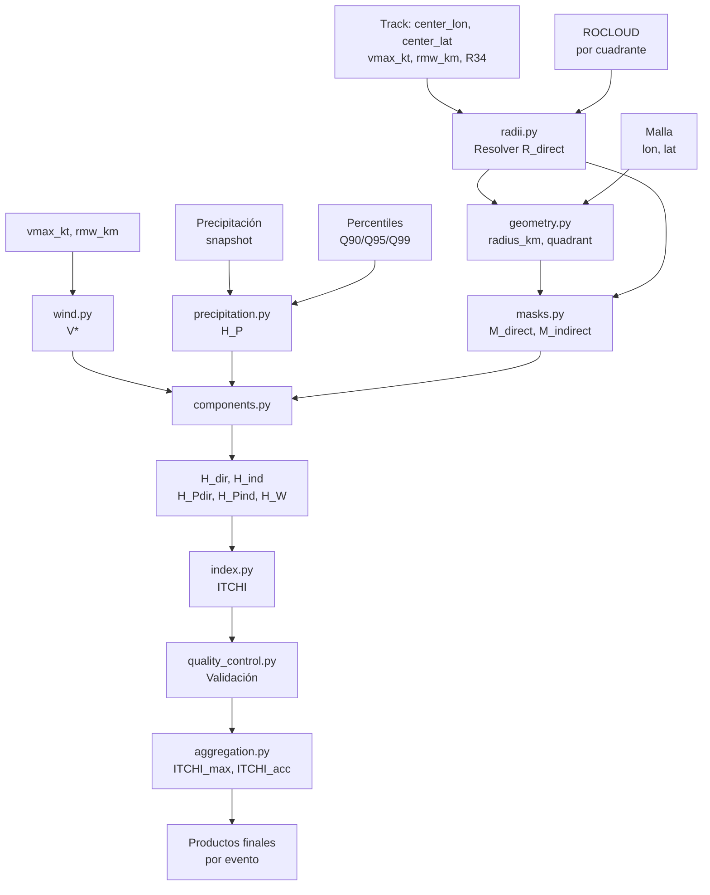

# Arquitectura del repositorio ITCHI Core

## 1. Propósito del repositorio

`itchi-core` contiene el núcleo computacional para calcular **ITCHI v0.1** (*Integrated Tropical Cyclone Hazard Index*).

El objetivo del repositorio es implementar de forma modular, trazable y reproducible el cálculo del índice físico de peligro asociado a ciclones tropicales.

El repositorio no busca resolver todavía:

- evaluación con declaratorias;
- agregación municipal definitiva;
- calibración estadística;
- productos finales para publicación;
- dashboard o visualización operativa.

Estas partes se consideran fases posteriores.

---

## 2. Principio general de ITCHI

ITCHI v0.1 calcula un índice continuo en el intervalo:

```text
0 ≤ ITCHI ≤ 1
```

El índice integra tres fuentes físicas de peligro:

1. precipitación directa dentro de `R_direct`;
2. viento dentro de `R_direct`;
3. precipitación indirecta entre `R_direct` y `ROCLOUD`.

La región exterior a `ROCLOUD` no contribuye al índice.

---

## 3. Convenciones principales

### 3.1. Resolución espacial

La resolución espacial objetivo es:

```text
0.1° × 0.1°
```

Esta resolución es compatible con la malla de precipitación usada como referencia.

### 3.2. Resolución temporal

El índice se evalúa en tiempos sinópticos:

```text
00, 06, 12 y 18 UTC
```

### 3.3. Precipitación

En la arquitectura actual del repositorio, la precipitación se maneja como:

```text
snapshot
```

Esto significa que el campo de precipitación se toma como un estado o intensidad válida en un tiempo determinado. Por tanto, el núcleo del repositorio no debe asumir que la precipitación es acumulada.

### 3.4. Radios y nomenclatura

Los radios se manejan por cuadrante usando la convención interna:

```text
RNE = radio noreste
RSE = radio sureste
RSW = radio suroeste
RNW = radio noroeste
```

**Nomenclatura de radios:**

- **`R34`**: radio de vientos de 34 nudos, tomado de IBTrACS o best-track.
- **`R_direct`**: radio efectivo de región directa (puede ser `R34` o `RMW` según disponibilidad).
- **`RMW`**: radio de máxima intensidad de viento (Radio of Maximum Wind).
- **`ROCLOUD`**: radio externo de cobertura nubosa (región indirecta).

### 3.5. Unidades

Todas las comparaciones geométricas se realizan en kilómetros:

```text
radius_km
R_direct_q
ROCLOUD_q
```

deben estar en kilómetros antes de construir máscaras.

Si radios provienen de IBTrACS en millas náuticas, deben convertirse mediante:

```text
1 nautical mile = 1.852 km
```

---

## 4. Estructura actual del paquete

La estructura principal del paquete es:

```text
src/
└── itchi/
    ├── __init__.py
    ├── constants.py
    ├── config.py
    ├── units.py
    ├── radii.py
    ├── geometry.py
    ├── precipitation.py
    ├── masks.py
    ├── components.py
    ├── index.py
    ├── aggregation.py
    ├── wind.py
    ├── rocloud.py
    ├── quality_control.py
    ├── io.py
    ├── tracks.py
    └── pipeline.py
```

---

## 5. Responsabilidad de cada módulo

### 5.1. `constants.py`

Define constantes generales del proyecto.

Responsabilidades:

* versión del índice;
* rango válido de ITCHI;
* percentiles principales;
* horas sinópticas;
* nombres oficiales de cuadrantes;
* constantes numéricas básicas;
* umbrales de intensidad.

Ejemplos:

```python
ITCHI_MIN_VALUE = 0.0
ITCHI_MAX_VALUE = 1.0
PRECIP_PERCENTILES = (90, 95, 99)
QUADRANTS = ("RNE", "RSE", "RSW", "RNW")
TROPICAL_DEPRESSION_THRESHOLD_KT = 34.0
```

---

### 5.2. `config.py`

Lee archivos de configuración YAML.

Responsabilidades:

* cargar `configs/default.yaml`;
* validar que el archivo exista;
* devolver la configuración como diccionario;
* identificar la raíz del proyecto;
* cargar configuración local opcional desde `configs/local.yaml`.

Uso esperado:

```python
from itchi.config import load_default_config

cfg = load_default_config()
```

---

### 5.3. `units.py`

Maneja conversiones de unidades y normalización de cuadrantes.

Responsabilidades:

* convertir millas náuticas a kilómetros;
* convertir kilómetros a millas náuticas;
* normalizar nombres de cuadrantes (NE → RNE);
* convertir radios por cuadrante a kilómetros.

Uso esperado:

```python
from itchi.units import convert_quadrant_radii_to_km

r34_km = convert_quadrant_radii_to_km(
    radii_by_quadrant={
        "NE": 60.0,
        "SE": 50.0,
        "SW": 40.0,
        "NW": 70.0,
    },
    input_unit="nm",
)
```

Salida esperada:

```python
{
    "RNE": 111.12,
    "RSE": 92.60,
    "RSW": 74.08,
    "RNW": 129.64,
}
```

---

### 5.4. `radii.py`

Resuelve radios por cuadrante y define el radio efectivo de región directa.

Responsabilidades:

* estandarizar radios por cuadrante;
* rellenar cuadrantes faltantes con el promedio de valores disponibles;
* distinguir entre `R34` observado y `R_direct` efectivo;
* usar `RMW` como radio directo cuando no existe `R34` en depresiones tropicales;
* conservar metadatos sobre imputación y fallback;
* validar coherencia entre radios.

Regla principal:

```text
Si R34 existe en todos o mayoría de cuadrantes:
    R_direct_q = R34_q (rellenando faltantes con promedio)

Si R34 es muy parcial y Vmax < 34 kt:
    R_direct_q = RMW (si existe)

Si no existe R34 ni RMW:
    usar fallback_direct_radius_km (de configuración)
```

Uso esperado:

```python
from itchi.radii import resolve_direct_radius

result = resolve_direct_radius(
    r34_by_quadrant={"RNE": 60, "RSE": 50},
    rmw_km=15.0,
    vmax_kt=45.0,
    fallback_km=40.0,
)
# result: {"RNE": 60, "RSE": 50, "RSW": 55, "RNW": 55}
```

---

### 5.5. `geometry.py`

Calcula geometría relativa al centro del ciclón.

Responsabilidades:

* calcular distancia radial celda-centro;
* asignar cuadrante relativo a cada celda;
* asignar radios por cuadrante a cada celda;
* construir campos geométricos base.

Entradas típicas:

```text
lon (malla)
lat (malla)
center_lon
center_lat
R_direct por cuadrante
ROCLOUD por cuadrante
```

Salidas típicas:

```text
radius_km
quadrant
R_direct_q
ROCLOUD_q
```

Este módulo permite pasar de información del ciclón por cuadrante a campos espaciales sobre la malla.

---

### 5.6. `precipitation.py`

Calcula el peligro normalizado por precipitación.

Responsabilidades:

* recibir un campo de precipitación tipo snapshot;
* recibir percentiles locales `Q90`, `Q95`, `Q99`;
* calcular `H_P` en el intervalo `[0, 1]`;
* manejar valores faltantes.

La lógica por tramos es:

```text
P < Q90        → H_P = 0
Q90 ≤ P < Q95 → H_P = (P - Q90) / (Q95 - Q90) * 0.5
Q95 ≤ P < Q99 → H_P = 0.5 + (P - Q95) / (Q99 - Q95) * 0.5
P ≥ Q99       → H_P = 1
```

Salida principal:

```text
H_P
```

---

### 5.7. `masks.py`

Construye las regiones espaciales de ITCHI.

Responsabilidades:

* construir máscara directa;
* construir máscara indirecta;
* construir máscara exterior;
* garantizar separación espacial entre regiones;
* validar no solapamiento.

Definiciones:

```text
M_direct   = r <= R_direct_q
M_indirect = R_direct_q < r <= ROCLOUD_q
M_exterior = r > ROCLOUD_q
```

Salidas:

```text
M_direct
M_indirect
M_exterior
```

---

### 5.8. `wind.py`

Construye y normaliza el peligro por viento `V*`.

Responsabilidades:

* construir un perfil radial simple de viento a partir de `Vmax` y `RMW`;
* normalizar viento en el intervalo `[0, 1]`;
* manejar sistemas con `Vmax < 34 kt`;
* permitir que el pipeline use `V*` precalculado o lo construya internamente;
* aplicar máscara directa al campo de viento.

Modos para sistemas bajo 34 kt:

| Modo | Interpretación |
|---|---|
| `relative_to_vmax` | peligro relativo respecto a `Vmax` |
| `zero` | peligro por viento igual a cero |
| `disabled` | módulo deshabilitado, usar valores externos |

Salida esperada:

```text
V* (normalizado en [0, 1])
```

---

### 5.9. `rocloud.py`

Lectura y limpieza de radios ROCLOUD.

Responsabilidades:

* estandarizar radios ROCLOUD por cuadrante;
* rellenar cuadrantes faltantes con el promedio disponible;
* validar que `ROCLOUD_q >= R_direct_q`;
* aplicar fallbacks de configuración si es necesario;
* conservar metadatos sobre fuente e imputación.

Entrada típica:

```python
rocloud_by_quadrant = {"RNE": 250, "RSE": 220, ...}
```

Salida típica:

```python
{"RNE": 250, "RSE": 220, "RSW": 230, "RNW": 240}
```

---

### 5.10. `components.py`

Construye los componentes físicos previos al índice final.

Responsabilidades:

* calcular precipitación directa `H_Pdir`;
* calcular precipitación indirecta `H_Pind`;
* calcular peligro por viento `H_W`;
* calcular componente directo `H_dir`;
* calcular componente indirecto `H_ind`.

Definiciones:

```text
H_Pdir = M_direct * H_P
H_Pind = M_indirect * H_P
H_W    = M_direct * V*
```

Componente directo (integración no-lineal):

```text
H_dir = 1 - (1 - H_W)^alpha * (1 - H_Pdir)^beta
```

Donde típicamente `alpha = 1.0` y `beta = 1.0`.

Componente indirecto:

```text
H_ind = H_Pind
```

---

### 5.11. `index.py`

Calcula el índice final ITCHI.

Responsabilidades:

* integrar `H_dir` e `H_ind`;
* mantener el índice acotado en `[0, 1]`;
* permitir pesos de sensibilidad `lambda_direct` y `mu_indirect`;
* aplicar clipping final si es necesario.

Fórmula general:

```text
ITCHI = 1 - (1 - H_dir)^lambda_direct * (1 - H_ind)^mu_indirect
```

Para la versión base:

```text
lambda_direct = 1.0
mu_indirect = 1.0
```

---

### 5.12. `aggregation.py`

Construye productos derivados por evento a partir de varios snapshots temporales de ITCHI.

Responsabilidades:

* calcular el máximo temporal de ITCHI por celda;
* calcular el acumulado acotado de ITCHI por celda;
* preservar dimensiones y coordenadas cuando se usa `xarray`;
* mantener los productos derivados dentro del intervalo `[0, 1]`;
* manejar valores faltantes o incompletos.

Productos principales:

```text
ITCHI_max = max(ITCHI_t)

ITCHI_acc = 1 - product(1 - ITCHI_t)
```

Uso esperado:

```python
from itchi.aggregation import compute_event_products

products = compute_event_products(
    itchi=itchi_snapshots,
    dim="time",
)
```

Salidas esperadas:

```python
products["ITCHI_max"]
products["ITCHI_acc"]
```

Este módulo permite pasar del producto espacio-temporal base:

```text
ITCHI_g,h,t
```

a productos resumidos por evento:

```text
ITCHI_max_g,h
ITCHI_acc_g,h
```

---

### 5.13. `quality_control.py`

Validaciones físicas y computacionales de resultados intermedios y finales.

Responsabilidades:

* validar rangos de variables (H_P, H_W, H_dir, H_ind, ITCHI en [0, 1]);
* verificar coherencia de radios (R_direct_q <= ROCLOUD_q);
* validar no solapamiento de máscaras;
* verificar que región exterior no contribuye;
* detectar y reportar valores anómalos;
* preservar dimensiones y coordenadas en `xarray`;
* generar reportes de validación detallados.

Salida típica:

```python
validation_result = {
    "valid": True,
    "errors": [],
    "warnings": ["valor de H_P superior a 1 en 5 celdas"],
    "statistics": {...}
}
```

---

### 5.14. `io.py`

Lectura y escritura de archivos.

Responsabilidades:

* leer archivos NetCDF, Zarr, HDF5;
* escribir productos en NetCDF, Zarr o Parquet;
* preservar metadatos (atributos, dimensiones);
* manejar compresión y chunking;
* validar formato antes de lectura/escritura.

Formatos soportados:

```text
Lectura: NetCDF, Zarr, HDF5, CSV
Escritura: NetCDF, Zarr, Parquet
```

---

### 5.15. `tracks.py`

Lectura y estandarización de trayectorias ciclónicas.

Responsabilidades:

* leer trayectorias desde IBTrACS, best-track local o CSV;
* estandarizar estructura de datos;
* extraer información por timestamp: centro, intensidad, radios;
* validar continuidad y coherencia temporal;
* interpolar posiciones si es necesario.

Entrada típica:

```python
track = read_track("path/to/ibtracs_file.nc", storm_id="2024001N")
```

Salida típica:

```python
{
    "time": [...],
    "center_lon": [...],
    "center_lat": [...],
    "vmax_kt": [...],
    "rmw_km": [...],
    "r34_ne": [...],
    ...
}
```

---

### 5.16. `pipeline.py`

Integra los módulos anteriores en funciones de cálculo coherentes.

Responsabilidades:

* orquestar el flujo de cálculo;
* recibir inputs geográficos, ciclónicos y meteo;
* invocar módulos en orden correcto;
* aplicar validaciones intermedias;
* retornar productos estructurados;
* soportar tanto numpy como xarray.

Función principal:

```python
compute_itchi_snapshot(
    lon,
    lat,
    center_lon,
    center_lat,
    precipitation,
    percentiles,
    r34_by_quadrant=None,
    rmw_km=None,
    rocloud_by_quadrant=None,
    vmax_kt=None,
    wind_mode="relative_to_vmax",
    return_components=True,
    validate=True,
)
```

Retorna diccionario con:

```python
{
    "ITCHI": ...,
    "H_P": ...,
    "H_W": ...,
    "H_Pdir": ...,
    "H_Pind": ...,
    "H_dir": ...,
    "H_ind": ...,
    "M_direct": ...,
    "M_indirect": ...,
    "M_exterior": ...,
    "metadata": {...}
}
```

---

## 6. Flujo computacional actual

El flujo actual del repositorio es:

```text
Track del ciclón
    (center_lon, center_lat, vmax_kt, rmw_km, R34)
        ↓
ROCLOUD por cuadrante
        ↓
radii.py: Resolución de R_direct
        ↓
R_direct_q, ROCLOUD_q (km)
        ↓
geometry.py: Construcción de campos
        ↓
radius_km, quadrant, R_direct_q, ROCLOUD_q
        ↓
Precipitación snapshot + Q90/Q95/Q99
        ↓
precipitation.py: Cálculo de H_P
        ↓
wind.py: Construcción de V*
        ↓
masks.py: Construcción de máscaras
        ↓
M_direct, M_indirect, M_exterior
        ↓
components.py: Cálculo de H_Pdir, H_Pind, H_W, H_dir, H_ind
        ↓
index.py: Cálculo de ITCHI
        ↓
ITCHI_g,h,t
        ↓
quality_control.py: Validación
        ↓
aggregation.py: Agregación temporal por evento
        ↓
ITCHI_max_g,h, ITCHI_acc_g,h
```

---

## 7. Diagrama de flujo mejorado



---

## 8. Flujo operativo actual

Con los módulos implementados, el flujo operativo es:

```text
1. Leer configuración (config.py)
2. Leer track de un ciclón (tracks.py)
3. Leer precipitación snapshot (io.py)
4. Leer percentiles Q90/Q95/Q99 (climatología)
5. Leer o construir ROCLOUD (rocloud.py)
6. Resolver R_direct (radii.py)
7. Construir geometría ciclónica (geometry.py)
8. Calcular H_P (precipitation.py)
9. Construir V* (wind.py)
10. Construir máscaras (masks.py)
11. Calcular H_Pdir, H_Pind, H_W (components.py)
12. Calcular H_dir, H_ind (components.py)
13. Calcular ITCHI (index.py)
14. Validar (quality_control.py)
15. Guardar producto ITCHI por snapshot (io.py)
16. Agregar por evento (aggregation.py)
```

---

## 9. Productos esperados

### 9.1. Producto por snapshot

Producto base:

```text
ITCHI_g,h,t
```

Este producto conserva:

```text
lat
lon
storm_id
time
```

Variables mínimas recomendadas:

```text
ITCHI
H_P
H_Pdir
H_Pind
H_W
H_dir
H_ind
M_direct
M_indirect
M_exterior
V*
```

Atributos recomendados:

```text
storm_id
storm_name
vmax_kt (velocidad máxima)
rmw_km (radio de máxima intensidad)
center_lon / center_lat
source (IBTrACS, best-track, etc)
```

---

### 9.2. Producto por evento

A partir de todos los snapshots de un ciclón se espera calcular:

```text
ITCHI_max_g,h
ITCHI_acc_g,h
```

Donde:

```text
ITCHI_max = máximo temporal de ITCHI por celda

ITCHI_acc = 1 - product(1 - ITCHI_t)
```

Metadatos por evento:

```text
storm_id
storm_name
start_time
end_time
n_snapshots
vmax_observed
```

---

## 10. Pruebas implementadas

El repositorio incluye pruebas unitarias para validar:

| Archivo de prueba | Objetivo |
|---|---|
| `tests/test_precipitation.py` | Normalización de precipitación |
| `tests/test_masks.py` | Máscaras directa, indirecta y exterior |
| `tests/test_components.py` | Componentes físicos |
| `tests/test_index.py` | Cálculo final de ITCHI |
| `tests/test_pipeline.py` | Integración por snapshot |
| `tests/test_geometry.py` | Distancia radial y cuadrantes |
| `tests/test_units.py` | Conversión de unidades |
| `tests/test_aggregation.py` | Productos derivados por evento |
| `tests/test_radii.py` | Resolución de radios directos |
| `tests/test_wind.py` | Construcción y normalización de viento |
| `tests/test_rocloud.py` | Resolución de ROCLOUD |
| `tests/test_quality_control.py` | Validaciones de calidad |
| `tests/test_tracks.py` | Lectura de trayectorias |
| `tests/test_io.py` | Lectura y escritura de archivos |

---

## 11. Reglas de consistencia

La implementación debe verificar como mínimo:

1. `ITCHI` debe permanecer en `[0, 1]`.
2. `H_P`, `H_W`, `H_dir`, `H_ind`, `V*` deben permanecer en `[0, 1]`.
3. `H_Pdir` y `H_Pind` son productos de máscara con otro campo, así que también en `[0, 1]`.
4. La región exterior no debe contribuir al índice (máscara exterior = 0).
5. Las máscaras directa, indirecta y exterior no deben solaparse.
6. `R_direct_q` y `ROCLOUD_q` deben estar en kilómetros.
7. `R_direct_q <= ROCLOUD_q` siempre.
8. Los cuadrantes deben usar la convención interna `RNE`, `RSE`, `RSW`, `RNW`.
9. La precipitación debe ser comparable con la climatología usada para calcular `Q90`, `Q95` y `Q99`.
10. El pipeline debe preservar dimensiones y coordenadas cuando se usen objetos `xarray`.
11. Los radios rellenados (imputación) deben documentarse en metadatos.
12. Valores faltantes deben propagarse coherentemente.

---

## 12. Módulos pendientes

Los siguientes módulos se consideran para desarrollo futuro:

| Módulo | Propósito | Estado |
|---|---|---|
| `compiler.py` | Orquestación de múltiples snapshots y ciclones | Planeado |
| `precipitation_snapshots.py` | Alineación temporal de precipitación | Opcional |
| `climatology.py` | Manejo formal de percentiles Q90, Q95, Q99 | Futuro |

---

## 13. Decisiones arquitectónicas

### 13.1. Radio de región directa

Se distingue explícitamente:

- **`R34`**: radio observado de 34 nudos (puede ser parcial o ausente).
- **`R_direct`**: radio efectivo para cálculos (R34 completado o RMW como fallback).

Esta separación permite mayor flexibilidad en depresiones tropicales y sistemas débiles.

### 13.2. Normalización de viento

El viento normalizado `V*` se construye internamente usando:

- Perfil radial simple función de `Vmax` y `RMW`.
- Normalización lineal respecto a `Vmax`.
- Modo configurable para sistemas sub-34 kt.

### 13.3. Validación temprana

El módulo `quality_control.py` se ejecuta después de cada componente crítico, permitiendo:

- Detección temprana de errores.
- Generación de reportes detallados.
- Trazabilidad del cálculo.

### 13.4. Preservación de coordenadas

Cuando se usa `xarray`:

- Las dimensiones originales se preservan.
- Se añaden atributos de traza (storm_id, time, etc).
- Metadatos de imputación se registran explícitamente.

---

## 14. Decisiones abiertas

Estas decisiones se documentan como pendientes:

1. Formato principal de salida: NetCDF, Zarr o Parquet (pendiente).
2. Convención definitiva para nombres de variables de entrada (en progreso).
3. Manejo de snapshots faltantes de precipitación.
4. Definición de rutas locales mediante `configs/local.yaml` (parcialmente implementada).
5. Compresión y chunking en escritura de archivos grandes.
6. Interpolación temporal de posiciones en tracks con gaps.
7. Criterios para activar/desactivar validaciones en producción.

---

## 15. Próximos pasos recomendados

### Corto plazo

1. Completar cobertura de pruebas (target: > 90%).
2. Documentar funciones con docstrings tipo NumPy.
3. Crear ejemplos de uso en notebooks.

### Mediano plazo

1. Implementar `compiler.py` para múltiples snapshots/ciclones.
2. Optimizar desempeño en mallas grandes.
3. Validar con datos reales de ciclones históricos.

### Largo plazo

1. Dashboard operativo.
2. Integración con sistemas de pronóstico.
3. Calibración estadística con declaratorias.

---

## 16. Referencias y estándares

- **IBTrACS**: International Best Track Archive for Climate Stewardship. https://www.ncei.noaa.gov/products/international-best-track-archive
- **NetCDF**: Climate and Forecast (CF) Conventions. http://cfconventions.org/
- **Xarray**: N-dimensional labeled arrays and datasets. https://xarray.pydata.org/
- **NumPy**: Array computing with Python. https://numpy.org/
